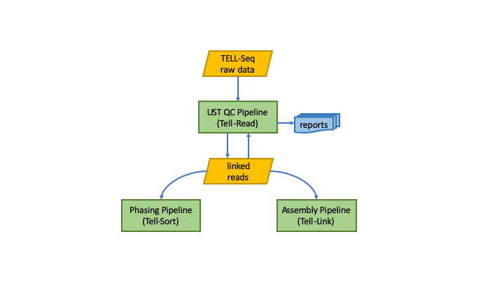

# Tellysis - Software Suite for TELL-Seq Linked Reads  

## Overview

Tellysis provides three data analysis pipelines to process Linked Read data generated by TELL-Seq technology: Tell-Read, Tell-Sort and Tell-Link.




## Tell-Read

Tell-Read pipeline takes output data produced by Illumina Sequencers using TELL-Seq Library Prep Kits. The pipeline performs quality control processing on barcodes, generates TELL-Seq linked reads and reports the performance on barcodes and DNA sequencing reads.

## Tell-Sort

Tell-Sort pipeline processes TELL_Seq linked reads in output by Tell-Read pipeline. The pipeline performs following activities: genome alignment, mark duplication, variant calling and phasing.

## Tell-Link

Tell-Link is the _de novo_ assembly pipeline for TELL-Seq linked reads.  It takes the output reads in FASTQ format from Tell-Read pipeline as input. 


## Setup

Save a copy of shell script `script/download_tellysis` on your local system.

## Download 

To download distribution packages for Tellysis pipelines, follow this step:

```
download_tellysis <token> <file>
```
where `<token>` is a string token emailed to you when you signed up for Tellysis software downloads. `<file>` is the distribution package file name for the pipelines. For Tell-Read, this is `tellread.tar.gz`; for Tell-Sort, it's `tellsort.tar.gz` and for Tell-Link, it's `tellink.tar.gz`.

## Dependencies

Tellysis pipelines are delivered as container images. It runs in the Docker environment. There is no additional sofware dependencies.

## System Requirements

<!---[Tell-Read v0.9.0](https://github.com/universalsequencing/tellysis/releases/download/0.9.0/tellread.tar.gz)--->

